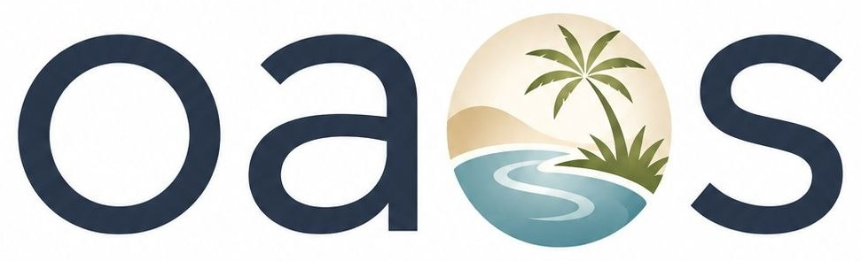
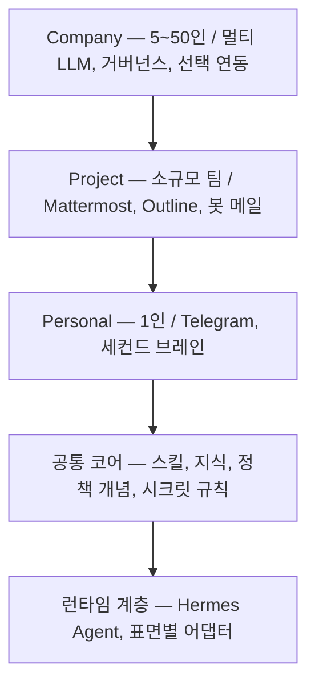

# Open Agent OS

### 내 에이전트, 내 머신, 내 규칙.

**URL 하나로 시작해, 1인 미니PC에서 50인 기업까지 함께 성장하는 셀프 호스팅 에이전트 OS.** [Hermes Agent](https://hermes-agent.nousresearch.com/docs) 기반 · Personal·Project는 오픈소스(Apache 2.0), Company는 소스 공개(BSL 1.1).

**한국어** | [English](README.md)

<p align="center">
  
</p>

> **약속:** Hermes Agent를 설치하고 채팅창에 이 저장소의 URL을 건네세요 — *"openit-ai/open-agent-os 설치해줘."* 에이전트가 3개 에디션을 설명하고, 고른 에디션을 설치하고, 몇 번의 원터치 게이트(링크 열기·선택·값 붙여넣기)만 요청한 뒤, 전 과정을 실제로 테스트하고 보고합니다. 설치는 매뉴얼이 아니라 대화입니다.

---

## 왜 Open Agent OS인가요?

**내 것, 빌린 것이 아닙니다.** 에이전트가 내 하드웨어(집의 미니PC, 팀의 VPS, 회사 서버)에서 삽니다. 대화·파일·지식이 그 안에 남습니다. 사용자당 클라우드 요금도, 데이터의 외부 유출도, 떠날 수 없는 서비스도 없습니다.

**설치는 URL 하나로 끝납니다.** 부트스트랩이 대화입니다. 에이전트가 저장소를 읽고, 선택지를 설명하고, 설치를 실행하고, 실제 검증으로 단계마다 확인한 뒤, 동작하는 시스템을 건네줍니다. 이해하지 못하는 명령을 붙여넣을 일이 없습니다.

**인디 비용, 엔터프라이즈 역량.** Personal 에디션은 N100급 미니PC와 저가 정액 LLM 플랜(월 약 $10)으로 돌아갑니다. 이미 쓰는 도구(Telegram·Mattermost·Outline·Slack·Notion·Google Workspace·Microsoft 365)는 **연결**될 뿐 대체되지 않습니다. 새로 추가되는 구독은 없습니다.

**쌓이는 세컨드 브레인.** 대화·문서·결정이 내 위키에 기록되고, 에이전트가 상호참조와 일관성을 관리합니다. 상태를 기억하지 못하는 챗봇과 달리, 내 맥락이 자산으로 쌓입니다 — 그리고 그 자산은 내 것으로 남습니다.

**작게 시작하고, 다시 만들 필요 없습니다.** Personal → Project → Company가 하나의 코어 위에 있습니다. 혼자 시작해서, 준비되면 팀원·공유 지식·거버넌스를 더하면 됩니다. 같은 스킬, 같은 파일, 같은 에이전트 — 규모만 커집니다.

**안전은 기본값, 규모에서도 통제.** 파괴적 작업은 승인 후에만 실행됩니다. 시크릿은 한 곳에만 보관되고 채팅·로그에 재출력되지 않습니다. 기업 규모에서는 정책·감사·관리 콘솔이 더해집니다 — 이미 상용 운영 중인 플랫폼에서 이어받은 기능입니다.

## URL 하나의 경험

```text
나      openit-ai/open-agent-os 설치해줘

에이전트  에디션이 3개입니다: Personal(1인), Project(소규모 팀),
         Company(5~50인). 이 머신에는 Personal이 맞습니다. 진행할까요?

나      응

에이전트  설치 중… ✓ Hermes  ✓ 게이트웨이  ✓ Telegram 연결
         게이트 2개만 부탁드릴게요: 봇 토큰 붙여넣기, 사용자 ID 붙여넣기.
         ✓ LLM 플랜 연결  ✓ 위키 시딩  ✓ 예약 작업 등록
         ✓ 재부팅 생존 확인

에이전트  완료 — 전 과정 검증됐습니다. 이걸 시도해보세요:
         "매일 아침 8시에 브리핑해줘". 전체 레시피: docs/cookbook.md
```

## 에디션

| | **Personal** | **Project** | **Company** |
|---|---|---|---|
| 대상 | 1인 | 소규모 팀(2~6인) | 중소기업(5~50인) |
| 구동 | 미니PC(N100급·16GB) | VPS 1대(4 vCPU·16GB·200GB) | Project + 거버넌스 레이어 |
| 설치 | 호스트 패키지와 systemd | 서명된 apt 패키지와 고정 Outline 소스 빌드·systemd | Project 호스트 서비스 승계 |
| 대화 창구 | Telegram | Mattermost + Telegram | + Slack *(옵션)* |
| 지식 | git 위키 + Obsidian | Outline + git 위키 | + Notion *(옵션)*, 권한 인식 인덱스 |
| 메일 | 개인(Himalaya) | 봇 전용 메일 | 기존 스위트 연동 |
| 모델 | 저가 정액 1종 | 저가 정액 중심 | 멀티 LLM 라우팅(프리미엄 선택) |
| 거버넌스 | 최소 | 팀 계정 | 정책·승인·감사·Vault·관리 콘솔 |
| 신규 비용 | 월 약 $10(LLM 정액) | + 서버 | + 거버넌스 인프라 |

> **비용 안내.** Google Workspace·Microsoft 365·Slack·Notion은 기업이 **이미 사용하며 지출 중인** 서비스입니다. OAOS는 이들에 **연결**할 뿐이며, 본 솔루션의 추가 비용이 아닙니다. 새로 드는 비용은 솔루션 자체(서버·LLM 정액)뿐입니다.

## 이걸로 무엇을 하나요

- **Personal** — 아침 브리핑, 메일 분류, 위키에 지식 기록, 예약 알림, 리서치 요약. 전부 폰의 Telegram에서.
- **Project** — Mattermost 속 팀 어시스턴트, 회의록이 위키 문서로, 주간 리포트, 공유 문서 검색, 봇 전용 메일함.
- **Company** — 구성원마다 거버넌스가 적용된 개인 에이전트, 권한을 지키는 사내 지식 검색, 전사 정책·감사, 선택적 Slack·Notion·Workspace·365 연동.

## 컴퓨터 사용 (Computer Use) — 에이전트의 손

에이전트는 답만 하지 않고, 자신이 돌아가는 머신의 브라우저와 프로그램을 직접 다룹니다. 문서를 만들고, 업무 사이트에 입력하고, 각종 서류를 발급받아 옵니다 — 결제·발송·삭제처럼 위험한 동작은 항상 승인을 거칩니다.

- **한글 문서 작성** — 양식 기반 HWPX 문서(정부과제·제안서·입찰·공문서) 초안을 만들어 줍니다. 최종 다듬기는 한컴독스(웹)나 보유한 한컴오피스에서 하면 됩니다.
- **업무 사이트 입력·제어** — 회계·세무·ERP 사이트의 로그인과 반복 입력을 자동화합니다. 공동인증서는 로컬 볼트에 보관하고, 서명·제출은 승인 후에만 실행합니다.
- **정부 사이트 서류 발급** — 신청 → 결제 → 발급 → 저장 → 위키 기록까지. 결제 단계에서는 멈추고 승인을 요청합니다.

설치(브라우저 자동화 환경)는 에이전트가 안내합니다. 단계별 레시피: [쿡북 §6](docs/cookbook.md). Company 에디션에서는 컴퓨터 사용에도 같은 정책·승인·감사가 적용됩니다.

## 빠른 시작 — "URL 하나로"

```text
1. Hermes Agent 설치        → 공식 설치: https://hermes-agent.nousresearch.com/docs
2. 이 저장소 URL 전달       → 예: "openit-ai/open-agent-os 설치해줘"
3. 에이전트 안내 따라가기    → README → START-HERE → skills/oaos-bootstrap 설치
4. 에디션 선택              → Personal / Project / Company
5. 게이트(3~6개)            → 링크 클릭·선택·키/토큰 붙여넣기 (즉시 검증)
6. 최종 테스트·보고          → 서비스·응답·파일·위키·크론·재부팅 생존
```

읽기·파일 편집·명령은 에이전트가 합니다. 사용자는 게이트만 처리합니다. [`START-HERE.md`](START-HERE.md)(에이전트용)와 [`skills/oaos-bootstrap/SKILL.md`](skills/oaos-bootstrap/SKILL.md)를 참조하세요.

## 저장소 구조

```text
skills/        OAOS와 함께 배포되는 Hermes 스킬 — oaos-bootstrap, oaos-ops (+ 옵션: promo-video-generation, higgsfield-media-generation, figma-design-generation, naver-cafe-manager, naver-blog-manager, sketchup-design-generation, vps-youtube-content)
harness/       설정 파일 템플릿(SOUL/USER/MEMORY/AGENTS) + 시딩 가이드
editions/      에디션별 안내 페이지 — personal / project / company
docs/          architecture-v2.0.md · cookbook.md · faq.md
bootstrap/     설치·검증 자동화 — 공용 라이브러리 + 에디션별 검증
```

## 스킬

OAOS와 함께 **코어 스킬**이 배포됩니다 — Hermes로 설치 가능한 `SKILL.md` 패키지입니다:

- **[`skills/oaos-bootstrap`](skills/oaos-bootstrap/SKILL.md)** — 부트스트랩 오케스트레이터: 환경 점검 → 에디션 선택 → 구축 → 게이트 → 검증 → 보고. 사용자가 이 저장소의 URL을 에이전트에게 건네면 실행되는 절차입니다.
- **[`skills/oaos-ops`](skills/oaos-ops/SKILL.md)** — 운영(day-2): 상태 점검, 백업, 업데이트, 복구, 로그 확인.

```bash
hermes skills install openit-ai/open-agent-os/skills/oaos-bootstrap
hermes skills install https://raw.githubusercontent.com/openit-ai/open-agent-os/main/skills/oaos-bootstrap/SKILL.md
```

**확장 스킬 (옵션 — 자체 API 키 필요):**

- **[`skills/promo-video-generation`](skills/promo-video-generation/SKILL.md)** — 장소 하나로 20초 실사 홍보영상: 문답 → 실사 이미지 → 컷 문안 → 생성(Higgsfield Seedance 2.5 / Kling 3.0). 생성 전 견적·승인 절차 내장.
- **[`skills/higgsfield-media-generation`](skills/higgsfield-media-generation/SKILL.md)** — 생성 헬퍼: Higgsfield API로 이미지·영상 생성(제출 → 폴링 → 다운로드), 비용 사전 견적 내장.
- **[`skills/figma-design-generation`](skills/figma-design-generation/SKILL.md)** — 채팅으로 Figma 디자인 제작: 공식 Figma MCP 서버로 화면·컴포넌트·다이어그램·디자인→코드 핸드오프를 만들고 전달 전 스크린샷으로 검수합니다. 무료 Figma 계정으로 시작(브라우저 로그인 1회).
- **[`skills/naver-cafe-manager`](skills/naver-cafe-manager/SKILL.md)** — 채팅으로 네이버 카페 운영: 키워드 신규글 감시·알림, 글 작성(초안 우선), 댓글 확인·응답, 본문·사진 수집 — 쿠키 인증 Playwright로 감시·수집·댓글 조회 실측 검증(쓰기는 초안 우선 설계).
- **[`skills/naver-blog-manager`](skills/naver-blog-manager/SKILL.md)** — 채팅으로 네이버 블로그 운영: 신규 글 감시, 글 작성(초안 우선), 댓글 확인·응답, 본문 md + 원본 화질 이미지 수집(zip 지원) 파이프라인 — 실측 검증.
- **[`skills/sketchup-design-generation`](skills/sketchup-design-generation/SKILL.md)** — 채팅으로 스케치업 3D 모델 제작: 드래그 대신 치수를 입력하는 정확 치수 모델링과 SKP/PNG/STL 내보내기를 헤드리스 스케치업 웹 세션에서 수행하고, 데스크톱 스케치업은 오픈소스 SketchUp-MCP 서버로 연결합니다.
- **[`skills/vps-youtube-content`](skills/vps-youtube-content/SKILL.md)** — VPS에서 YouTube IP·봇 차단으로 기본 자막 경로가 막힐 때 복구합니다: 차단 유형을 진단하고 최저비용 순 사다리(플레이어 클라이언트 회전 → PO Token 공급자 → 자격증명 없는 리더 프록시 → 사용자 승인 경로)를 적용합니다.

```bash
hermes skills install openit-ai/open-agent-os/skills/promo-video-generation
hermes skills install openit-ai/open-agent-os/skills/higgsfield-media-generation
hermes skills install openit-ai/open-agent-os/skills/figma-design-generation
hermes skills install openit-ai/open-agent-os/skills/naver-cafe-manager
hermes skills install openit-ai/open-agent-os/skills/naver-blog-manager
hermes skills install openit-ai/open-agent-os/skills/sketchup-design-generation
hermes skills install openit-ai/open-agent-os/skills/vps-youtube-content
```

스킬은 OAOS가 성장하는 방식입니다 — MCP 서버와 스킬을 추가하면 코어 변경 없이 에이전트의 능력이 늘어납니다.

## 하네스 & 설정 파일

에이전트의 정체성과 기억은 내 머신 위의 markdown 파일들로 구성됩니다 — 그 주위의 설정 표면까지 포함하면:

- **`SOUL.md`** — 사용자가 정의하는 페르소나와 일하는 원칙(소유: 사용자).
- **`USER.md`** — 사용자 프로필. 에이전트가 대화에서 자동으로 관리합니다(언제든 직접 수정 가능).
- **`MEMORY.md`** — 에이전트의 메모. 에이전트가 자동으로 작성·유지하며, 사용자가 교정할 수 있습니다.
- **`AGENTS.md`** — 프로젝트별 지침(팀·기업 워크스페이스용).

설정(`config.yaml`)·시크릿(`.env`)·스킬·예약 작업까지가 같은 표면입니다 — 전체 지도와 템플릿·시딩 가이드: [`harness/README.md`](harness/README.md).

## 쿡북 & FAQ

- **[`docs/cookbook.md`](docs/cookbook.md)** — 실제로 무엇을 하는지: 브리핑, 지식 기록, 메일, 일정, 팀 리포트, 거버넌스 흐름, 컴퓨터 사용, 백업까지.
- **[`docs/faq.md`](docs/faq.md)** — 설치·게이트·운영·보안·비용·에디션 질문.

## Company 에디션 기반

Company 에디션을 뒷받침하는 엔터프라이즈 플랫폼(개인 에이전트, Personal Wiki, 권한 인식 전사 지식 인덱스, 정책 + JIT 승인, 감사 원장, Secret Vault, Execution Gateway, 관리 콘솔)은 이 공개 저장소와 별도로 개발·제공됩니다. v2.0 설계에서 이 자산들은 **Company 에디션으로 흡수**됩니다 — 기존 코드·테스트는 버리지 않고 승계합니다.

- 범위·설치 흐름·라이선스: [`editions/company/README.md`](editions/company/README.md)

## 아키텍처 한눈에 (v2.0)



상세: [`docs/architecture-v2.0.md`](docs/architecture-v2.0.md).

## 로드맵

| 단계 | 범위 | 완료 판정 |
|---|---|---|
| **P0 — 부트스트랩 MVP (Personal)** | README/START-HERE, `skills/oaos-bootstrap`, `editions/personal` 설치, `bootstrap/verify` | 클린 머신에서 URL 1개 → 게이트 ≤5회 → verify 전 항목 PASS |
| **P1 — Project** | Project install/verify·Personal→Project 이전 스크립트 제공 | 신규 VPS E2E 완주 + 이전 실증 필요 |
| **P2 — Company** | 기존 플랫폼 흡수, 선택 연동(Slack/Notion), 멀티 LLM 라우팅, 거버넌스 | 전체 테스트 green + 런타임 read-back + 회귀 통과 |

## 라이선스

에디션별로 적용됩니다:

- **Personal·Project 에디션** — [`LICENSE`](./LICENSE) (Apache License 2.0). 오픈소스: 자유롭게 사용·수정·배포할 수 있습니다(상업적 사용 포함).
- **Company 에디션** — [`LICENSE-COMPANY`](./LICENSE-COMPANY) (Business Source License 1.1). 소스 공개: 평가·개발·테스트 사용은 허용되며, 프로덕션·상업적 사용은 별도 상업 라이선스가 필요합니다. Change Date(2030-08-27) 이후 Apache License 2.0으로 전환됩니다.

Copyright (c) 2026 OpenIT Co., Ltd.

## 문서 색인

- [`docs/architecture-v2.0.md`](docs/architecture-v2.0.md) — v2.0 3-에디션 설계(정본)
- [`START-HERE.md`](START-HERE.md) — 에이전트용 부트스트랩 절차
- [`docs/cookbook.md`](docs/cookbook.md) · [`docs/faq.md`](docs/faq.md)
- [`harness/README.md`](harness/README.md) — 하네스·설정 파일 구성
- [`skills/oaos-bootstrap/SKILL.md`](skills/oaos-bootstrap/SKILL.md) · [`skills/oaos-ops/SKILL.md`](skills/oaos-ops/SKILL.md) · [`skills/promo-video-generation/SKILL.md`](skills/promo-video-generation/SKILL.md) · [`skills/higgsfield-media-generation/SKILL.md`](skills/higgsfield-media-generation/SKILL.md) · [`skills/naver-cafe-manager/SKILL.md`](skills/naver-cafe-manager/SKILL.md) · [`skills/naver-blog-manager/SKILL.md`](skills/naver-blog-manager/SKILL.md) · [`skills/vps-youtube-content/SKILL.md`](skills/vps-youtube-content/SKILL.md)
- [`editions/personal`](editions/personal/README.md) · [`editions/project`](editions/project/README.md) · [`editions/company`](editions/company/README.md)
