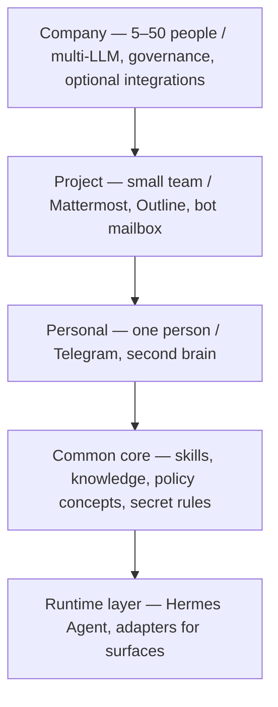

# Open Agent OS

### Your agent. Your machine. Your rules.

**The self-hosted agent OS that starts with a single URL — and grows with you from one mini PC to a company of 50 people.** Built on [Hermes Agent](https://hermes-agent.nousresearch.com/docs). Open source (Apache 2.0) for Personal & Project · source-available (BSL 1.1) for Company.

[한국어](README.ko.md) | **English**

<p align="center">
  
</p>

> **The promise:** install Hermes Agent, open its chat, and hand it this repository's URL — *"set up openit-ai/open-agent-os."* The agent explains the three editions, installs the one you choose, asks for a few one-tap gates (open a link, make a choice, paste a value), then tests everything end-to-end and reports. Setup is a conversation, not a manual.

---

## Why Open Agent OS?

**Yours, not rented.** Your agent lives on your hardware — a mini PC at home, a VPS for your team, your company's server. Conversations, files, and knowledge stay there. No per-seat cloud pricing, no data leaving your premises, no service you cannot walk away from.

**One URL is the whole setup.** The bootstrap is a conversation. The agent reads this repository, explains your options, runs the installation, verifies every step with real checks, and hands you a working system. You never paste a command you do not understand.

**Enterprise capability at indie cost.** The Personal edition runs on an N100-class mini PC with a low-cost flat LLM plan (≈ $10/month). The tools you already use — Telegram, Mattermost, Outline, Slack, Notion, Google Workspace, Microsoft 365 — get connected, not replaced. No new subscriptions.

**A second brain that compounds.** Every conversation, document, and decision can be filed into your own wiki, and the agent maintains the cross-references and consistency. Unlike a stateless chatbot, your context accumulates into an asset — and the asset stays yours.

**Start small, never re-platform.** Personal → Project → Company on one core. Begin with yourself; add teammates, shared knowledge, and governance when you are ready. Same skills, same files, same agent — just more of them.

**Safe by design, governed at scale.** Destructive actions need your approval. Secrets live in one protected place and are never echoed. At company scale you get policy, audit, and admin controls — from a platform that already runs in production.

## The one-URL experience

```text
You    set up openit-ai/open-agent-os

Agent  Sure — three editions: Personal (one person), Project (small team),
       Company (5–50 people). This machine fits Personal. Proceed?

You    yes

Agent  Installing… ✓ Hermes  ✓ gateway  ✓ Telegram connected
       Two quick gates: paste your bot token, paste your user ID.
       ✓ LLM plan connected  ✓ wiki seeded  ✓ scheduled jobs on
       ✓ survived a reboot

Agent  Done — verified end-to-end. Try: "brief me every morning at 8."
       Full recipe list: docs/cookbook.md
```

## Editions

| | **Personal** | **Project** | **Company** |
|---|---|---|---|
| For | one person | a small team (2–6) | a company (5–50) |
| Runs on | a mini PC (N100-class, 16 GB) | one VPS (4 vCPU / 16 GB / 200 GB) | Project + governance layer |
| Install | host packages and systemd | signed apt packages and pinned Outline source under systemd | inherits Project host services |
| Chat | Telegram | Mattermost + Telegram | + Slack *(optional)* |
| Knowledge | git wiki + Obsidian | Outline + git wiki | + Notion *(optional)*, permission-aware index |
| Mail | personal (Himalaya) | dedicated bot mailbox | existing suite integration |
| Models | one low-cost flat plan | low-cost flat plan | multi-LLM routing (premium optional) |
| Governance | minimal | team accounts | policy, approvals, audit, vault, admin console |
| New cost | ≈ $10/month LLM plan | + server | + governance infrastructure |

> **Cost note.** Google Workspace, Microsoft 365, Slack, and Notion are services a company already uses and pays for. OAOS **connects to them** — they are not an added cost of this solution. The only new costs are the solution itself (server and LLM flat plan).

## What you can do with it

- **Personal** — morning briefings, inbox triage, filing knowledge into your wiki, scheduled reminders, research summaries. All from your phone, in Telegram.
- **Project** — a team assistant in Mattermost, meeting notes that become wiki pages, weekly reports, shared document search, a dedicated bot mailbox.
- **Company** — a governed personal agent for every member, permission-aware company knowledge search, policy and audit across the fleet, optional Slack / Notion / Workspace / 365 integration.

## Computer use — the agent's hands

The agent doesn't just answer — it can operate the browser and applications on the machine where it runs. It drafts documents, enters data into work portals, and gets official paperwork issued for you — while risky actions like payments, sending, and deletions always pass through your approval first.

- **Hangul (HWP) documents** — drafts form-based HWPX documents (grant applications, proposals, bids, official letters); you do the final polish in Hancom Docs (web) or your own Hancom Office.
- **Work portals** — automates login and repeated entry on accounting, tax, and ERP sites. Korean public certificates (공동인증서) stay in your local vault; signing and submission run only after approval.
- **Government paperwork** — from application through payment, issuance, saving, and a wiki record. Payment steps pause for your approval.

Setup (the browser-automation environment) is guided by the agent. Step-by-step recipes: [Cookbook §6](docs/cookbook.md). On the Company edition, computer use is governed by the same policy, approvals, and audit.

## Quick start — "One URL"

```text
1. Install Hermes Agent        → official installer: https://hermes-agent.nousresearch.com/docs
2. Tell it this repository     → e.g. "set up openit-ai/open-agent-os"
3. Follow the agent            → README → START-HERE → installs skills/oaos-bootstrap
4. Pick an edition             → Personal / Project / Company
5. Gates (3–6)                 → click links, choose options, paste keys/tokens (each verified on the spot)
6. Verify & report             → services, responses, files, wiki, cron, reboot survival
```

The agent does the reading, the file edits, and the commands. You only handle the gates. See [`START-HERE.md`](START-HERE.md) (agent-facing) and [`skills/oaos-bootstrap/SKILL.md`](skills/oaos-bootstrap/SKILL.md).

## Repository map

```text
skills/        Hermes skills shipped with OAOS — oaos-bootstrap, oaos-ops (+ optional: promo-video-generation, higgsfield-media-generation)
harness/       config file templates (SOUL/USER/MEMORY/AGENTS) + seeding guide
editions/      Edition landing pages — personal / project / company
docs/          architecture-v2.0.md · cookbook.md · faq.md
bootstrap/     install & verify automation — shared lib + per-edition verify
```

## Skills

Core skills ship with OAOS — plain `SKILL.md` packages installable with Hermes:

- **[`skills/oaos-bootstrap`](skills/oaos-bootstrap/SKILL.md)** — the bootstrap orchestrator: environment check → edition selection → setup → gates → verify → report. This is what runs when you hand your agent this repository's URL.
- **[`skills/oaos-ops`](skills/oaos-ops/SKILL.md)** — day-2 operations: health checks, backups, updates, restores, log inspection.

```bash
hermes skills install openit-ai/open-agent-os/skills/oaos-bootstrap
hermes skills install https://raw.githubusercontent.com/openit-ai/open-agent-os/main/skills/oaos-bootstrap/SKILL.md
```

Optional extension skills — bring your own API keys:

- **[`skills/promo-video-generation`](skills/promo-video-generation/SKILL.md)** — 20-second live-action promo videos for a place: chat interview → live-action images → shot script → generation (Higgsfield Seedance 2.5 / Kling 3.0). Quote-and-approve before every run.
- **[`skills/higgsfield-media-generation`](skills/higgsfield-media-generation/SKILL.md)** — the generation helper: images and videos via the Higgsfield API (submit → poll → download), with cost estimates built in.

```bash
hermes skills install openit-ai/open-agent-os/skills/promo-video-generation
hermes skills install openit-ai/open-agent-os/skills/higgsfield-media-generation
```

Skills are how OAOS grows: add MCP servers and skills, and the agent gains capabilities without changing the core.

## Harness & configuration files

The agent's identity and memory are plain markdown files on your machine — plus a wider configuration surface around them:

- **`SOUL.md`** — the persona and working principles *you* define (you own this file).
- **`USER.md`** — your profile; the agent maintains it automatically from your conversations (you can edit it anytime).
- **`MEMORY.md`** — the agent's own notes; written and maintained by the agent, correctable by you.
- **`AGENTS.md`** — per-project instructions (for team/company workspaces).

Settings (`config.yaml`), secrets (`.env`), skills, and schedules complete the surface — all mapped in [`harness/README.md`](harness/README.md), with templates and a seeding guide so your agent starts with a sane, personal harness instead of a blank one.

## Cookbook & FAQ

- **[`docs/cookbook.md`](docs/cookbook.md)** — what to actually do, day one and beyond: briefings, knowledge filing, mail, schedules, team reports, governance flows, computer use, backups.
- **[`docs/faq.md`](docs/faq.md)** — setup, gates, operations, security, costs, editions.

## Company edition base

The enterprise platform behind the Company edition — personal agents, a personal wiki, a permission-aware company knowledge index, policy + just-in-time approvals, an audit ledger, a secret vault, an execution gateway, and an admin console — is developed and delivered separately from this public repository. Under the v2.0 design these assets are **absorbed into the Company edition** — existing code and tests are carried over, not discarded.

- Scope, setup flow, and licensing: [`editions/company/README.md`](editions/company/README.md)

## Architecture at a glance (v2.0)



Full detail: [`docs/architecture-v2.0.md`](docs/architecture-v2.0.md).

## Roadmap

| Phase | Scope | Done when |
|---|---|---|
| **P0 — Bootstrap MVP (Personal)** | README/START-HERE, `skills/oaos-bootstrap`, `editions/personal` install, `bootstrap/verify` | Clean machine: one URL → ≤5 gates → all verify checks pass |
| **P1 — Project** | Project install/verify and Personal→Project migration scripts are available | End-to-end run on a fresh VPS + migration proof pending |
| **P2 — Company** | absorb existing platform, optional integrations (Slack/Notion), multi-LLM routing, governance | Full test suite green + runtime read-back + regression pass |

## License

Licensing is per edition:

- **Personal & Project editions** — [`LICENSE`](./LICENSE) (Apache License 2.0). Open source: free to use, modify, and distribute, including commercial use.
- **Company edition** — [`LICENSE-COMPANY`](./LICENSE-COMPANY) (Business Source License 1.1). Source-available: evaluation, development, and testing use is granted; production or commercial use requires a commercial license. Converts to Apache License 2.0 on the Change Date (2030-08-27).

Copyright (c) 2026 OpenIT Co., Ltd.

## Documentation index

- [`docs/architecture-v2.0.md`](docs/architecture-v2.0.md) — v2.0 three-edition design (canonical)
- [`START-HERE.md`](START-HERE.md) — the agent-facing bootstrap procedure
- [`docs/cookbook.md`](docs/cookbook.md) · [`docs/faq.md`](docs/faq.md)
- [`harness/README.md`](harness/README.md) — agent configuration files
- [`skills/oaos-bootstrap/SKILL.md`](skills/oaos-bootstrap/SKILL.md) · [`skills/oaos-ops/SKILL.md`](skills/oaos-ops/SKILL.md) · [`skills/promo-video-generation/SKILL.md`](skills/promo-video-generation/SKILL.md) · [`skills/higgsfield-media-generation/SKILL.md`](skills/higgsfield-media-generation/SKILL.md)
- [`editions/personal`](editions/personal/README.md) · [`editions/project`](editions/project/README.md) · [`editions/company`](editions/company/README.md)
