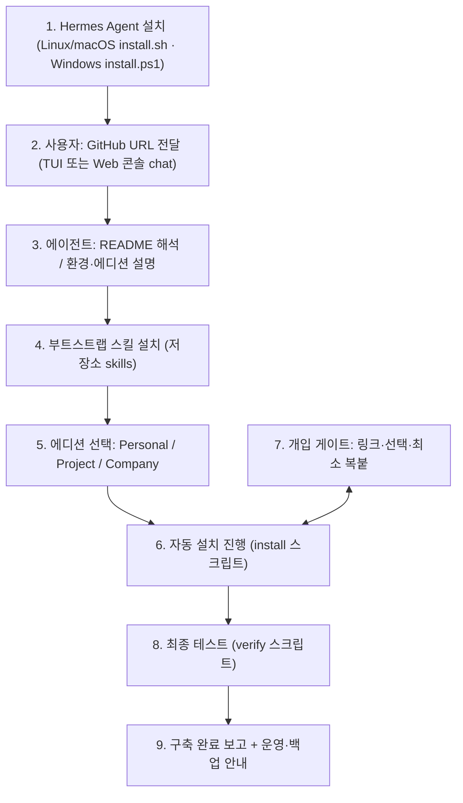
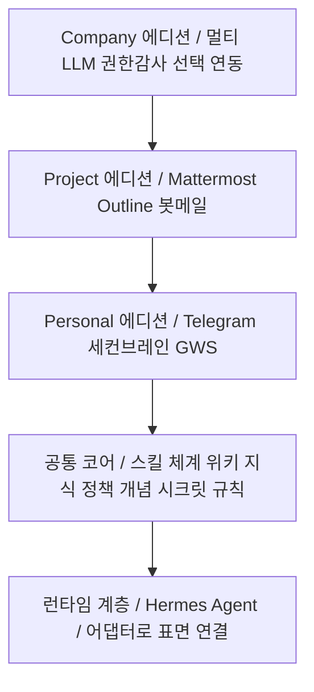

# Open Agent OS 아키텍처 및 구현 설계서 v2.0 — 3-에디션 · "URL 하나로 구축"

> **대상**: openit-ai/open-agent-os (제품 버전 v0.1.10 · 기존 아키텍처 v1.7.5 → 본 문서 v2.0)
> **관계**: 기존 v1.7.x 문서 = 현행 플랫폼 구현 기준서 · 본 문서 = 3-에디션 제품 방향 기준서 (제품 방향은 본 문서가 정본)
> **목표**: Hermes Agent 설치 후 **저장소 URL 하나를 알려주면** README 설명부터 대부분의 설치, 최종 테스트까지 에이전트가 자동 진행 — 사용자는 **링크 확인·선택·최소 복사/붙여넣기**만 한다.
> **입력**: 3-에디션 설계 요구(2026-09-25) · 구축 실측 가이드 2종(개인용·프로젝트용, 2026-09-22)
> **버전**: v2.0 (2026-09-25) — 최종 검토본
> **수치 원칙**: 금액·제품명·경로·구성 값은 공식 출처로 검증해 기재(§0-1, 부록 C)

---

## 0. 한 장 요약

| 항목 | 내용 |
|---|---|
| 제품 | **Open Agent OS (OAOS)** — 3-에디션: **Personal / Project / Company** |
| 핵심 경험 | Hermes Agent 설치(공식) → **GitHub URL 1개 전달** → README 해석·환경 설명 → 부트스트랩 스킬로 설치 자동 진행 → 최종 테스트까지 완료 |
| 사용자 개입 | 게이트당 **링크 + 선택 + 최소 복붙** (선택 포함 Personal 5·Project 10·Company 14개소) |
| 적층 구조 | Personal ⊂ Project ⊂ Company — Company는 **5~50인 중소기업용 확장 에디션**(멀티 LLM 라우팅·권한·감사 + 선택형 연동) |
| 기준 실측 | Personal: 기존 Ubuntu 미니PC(N100급·16GB) 사례·월 $10 API(OpenCode Go 정액, 2026-09-25 확인); macOS·Windows 실기기 검증 대기 / Project: VPS 1대(4 vCPU·16GB·200GB급) |
| 비용 원칙 | 본 솔루션으로 **새로 드는 비용은 서버·LLM 정액 등 솔루션 자체 항목뿐** — Google Workspace·Microsoft 365·Slack·Notion 등은 **기업이 기존에 사용 중인 서비스에 연동**(추가 비용 없음) |
| 지원 환경 | Personal 설치 스크립트: Ubuntu LTS·Apple Silicon macOS·Windows 11 Git Bash; Project·Company: Ubuntu LTS 서버. 사전 요건: Hermes Agent 공식 설치 · 표면: TUI/Web 콘솔/메신저 |
| 배포 | GitHub(openit-ai/open-agent-os) + Hermes 스킬(URL 설치) |
| 최종 산출 | 동일 절차로 **누구나** 자기 환경(Personal~Company)을 구축·운영 |

### 0-1. 표기·검증 원칙 (문서 공통)

1. **제품·서비스명**: 공식 표기 사용 — Google Workspace, Microsoft 365, Slack, Notion, OpenCode Go, Telegram, Mattermost, Outline, Hermes Agent 등.
2. **금액**: 출처·확인일 병기 — 예: "월 $10(opencode.ai/go, 2026-09-25 확인)". 프로모션·지역 변동 항목은 "구매 시점 확인"을 명시.
3. **비용 서술 구분**: "본 솔루션으로 새로 발생하는 비용"과 "기업이 기존에 지출 중인 서비스(연동 대상)"를 구분한다 — 기존 지출 서비스는 솔루션 비용으로 계상하지 않는다.
4. **경로**: 홈(`~`)·저장소 상대경로 기준. 실환경 절대경로·계정명은 문서에 싣지 않는다.
5. **구성 값**(포트·사양·버전): 기본값과 변경 가능성을 함께 표기 — 예: "기본 포트 8065(변경 가능)".
6. **미확인 정보**: "미검증/확인 필요"로 명시 — 추정값을 확정 표현으로 쓰지 않는다.
7. **출처 등급**: 공식 문서·공식 사이트를 확정 근거로, 비공식 자료는 참고용으로 구분 표기.
8. **약어·기호**: 처음 등장할 때 뜻을 함께 밝힌다 — 예: OAOS(Open Agent OS), E(실설치 대상 환경). 문서 안에서 한 번 정의한 약어는 이후 설명 없이 사용한다.
9. **지칭**: 대상은 구체 명칭으로 쓴다 — "해당 서버"·"① 환경" 대신 "Project 호스트"·"Company 검증 인스턴스"처럼 문서에서 정의한 명칭을 반복해 쓴다.

---

## 1. 배경과 진단

- **기존 OAOS의 한계**: Hermes 권한을 줄이고 제어하는 기업용 래퍼로 출발 → 런타임(Hermes Agent)의 가치·기능을 쓰지 못하는 완성도 낮은 제품이 되어가는 중.
- **재설계 방향**: Hermes 네이티브 실행을 주체로 승격하고, 기존 자산(지식·위키·정책·세션·감사)은 상위 에디션(Company)으로 흡수한다.
- **목표 사용자**: 서버 운영 전문성은 없지만 컴퓨터를 다루는 개인·소규모 팀·중소기업(5~50인). **전문 절차는 에이전트가 대신 수행**하고, 사람은 선택과 승인만 한다.
- **핵심 성공 기준**: "설치를 가르치는 문서"가 아니라, **에이전트가 읽고 실행하는 저장소**. README는 사람과 에이전트가 함께 읽는 진입점이다.

---

## 2. 핵심 UX — "URL 하나로 구축"

### 2.1 사용자 여정



- 2단계 URL은 사용자가 채팅에 붙여넣는 한 줄이다: 예) `openit-ai/open-agent-os 이거 설치해줘`.
- 에이전트는 README → 부트스트랩 스킬 → 설치·검증 순으로 스스로 진행하고, **개입이 필요한 순간에만** 사용자에게 링크와 함께 요청한다.
- 표면(TUI/Web 콘솔/메신저)에 무관하게 동일하게 동작한다 — 스킬·스크립트가 로직을 가지므로.

### 2.2 부트스트랩 구성요소 (저장소 자산)

**지원 환경(설계 기준)**: Personal은 Ubuntu LTS·Apple Silicon macOS·Windows 11 Git Bash 설치/검증 스크립트가 구현됐고, Linux 스모크 및 타 OS 모의 검증을 완료했다. 3 OS CI 워크플로는 추가됐으며 러너 결과와 실기기 검증은 대기 중이다. Project·Company는 Ubuntu LTS 서버 경로다. 사전 요건 — Hermes Agent 공식 설치 · 표면 — TUI/Web 콘솔/메신저.

| 자산 | 역할 | 읽는 주체 |
|---|---|---|
| `README.md` / `README.ko.md` | 프로젝트 소개(3-에디션·비용·아키텍처) + **에이전트용 부트스트랩 블록** | 사람 + 에이전트 |
| `START-HERE.md` (또는 README 내 블록) | 에이전트가 따라야 할 정밀 절차(스킬 설치 → 선택 → 설치 → 검증) | 에이전트 |
| `skills/oaos-bootstrap/SKILL.md` | 오케스트레이터: 환경 점검→에디션 선택→install 호출→게이트 처리→verify→리포트 | 에이전트 |
| `editions/<e>/install.sh` | 에디션별 설치(멱등·체크포인트·로그) | 에이전트 실행 |
| `bootstrap/verify/<e>-verify.sh` | 최종 테스트(서비스·응답·파일·위키·크론·서비스 등록 확인); 실제 재부팅/로그인 생존은 별도 실기기 증거 | 에이전트 실행 |
| `bootstrap/lib/*` | 공통: 환경 점검·시크릿 처리(.env 600)·체크포인트·로그 | 공용 |
| `docs/editions/*.md` | 에디션별 설치·운영 문서(공통 표기 원칙으로 재작성) + Company 문서(예정) | 사람 + 에이전트 |

**스킬 설치 문법(2026-09-25 실측 확인)**: `hermes skills install <identifier | SKILL.md URL>` — Hermes CLI 도움말에서 "direct HTTP(S) URL to a SKILL.md file" 형식 지원을 확인(Hermes Agent v0.21.5 기준). README에는 `https://raw.githubusercontent.com/openit-ai/open-agent-os/main/skills/oaos-bootstrap/SKILL.md` 형식을 싣고, 저장소 푸시 후 P0에서 실설치로 최종 확인한다.

### 2.3 개입 게이트 설계 규칙 (사용자 부담 최소화)

1. 모든 게이트는 **① 클릭 가능한 링크 ② 왜 필요한지 1줄 ③ 붙여넣을 값의 정확한 지정** 순서로 안내한다.
2. 붙여넣은 값은 **즉시 검증**(API 200·토큰 getMe 등)하고, 실패 시 원인과 재시도 링크를 다시 제공한다.
3. 값은 `.env`(600)에만 저장 — 스킬은 값을 **재출력하지 않는다**. 로그·문서·위키에 남기지 않는다.
4. 게이트는 "선택"과 "제공(필수)" 두 종류만 존재한다. 그 외(설정 파일 편집·명령 타이핑)는 전부 에이전트 몫이다.
5. 게이트가 발생하기 전까지는 **무인 진행**을 원칙으로 하고, 진행 상황은 시작·게이트·검증·완료 시점에만 보고한다.

### 2.4 개입 지점 (에디션별)

**Personal — 필수 3 + 선택 2**

| # | 게이트 | 사용자 액션(최소) | 에이전트 제공 |
|---|---|---|---|
| G1 | LLM API 키 | OpenCode Go(또는 대안: OpenRouter·Vercel AI Gateway) 가입 → 키 복붙 | 가입 링크·요금 안내·대안 비교 |
| G2 | Telegram 봇 | BotFather `/newbot` → 토큰 복붙 | BotFather 링크·명령·주의(노출 시 revoke) |
| G3 | Telegram 사용자 ID | @userinfobot → 숫자 복붙 | 링크·화이트리스트 설명 |
| G4 | (선택) 대용량 파일 | my.telegram.org → api_id/hash 복붙 | 링크·절차·보안 경고 |
| G5 | (선택) 이메일 | Gmail 앱 비밀번호 16자 복붙 | 2단계 인증·발급 링크 |

**Project — Personal 게이트 + 5**

| # | 게이트 | 사용자 액션(최소) | 에이전트 제공 |
|---|---|---|---|
| G0 | 서버 준비 | VPS 구매(권장 사양 링크) 또는 기존 서버 접속 정보 | 사양 표·구매 링크·SSH 키 준비 안내 |
| G6 | 도메인 DNS | A 레코드 3개 등록(chat/note/portal) | 레코드 값 표 제공 → 전파 자동 확인 |
| G7 | Mattermost 관리자 | 초기 관리자 계정 생성(브라우저) | 접속 URL·단계 안내 |
| G8 | Outline API 토큰 | 관리자 가입 → API 토큰 발급·복붙 | 링크·발급 경로 안내 |
| G9 | 봇 전용 메일 | 전용 Gmail 생성 + 앱 비밀번호 복붙 | 이유(개인계정 정보보안 분리)·링크 |

**Company — Project 게이트 + 확장 게이트(제공 1 + 선택 3)**

| # | 구분 | 게이트 | 사용자 액션(최소) | 에이전트 제공 |
|---|---|---|---|---|
| G10 | 제공(필수) | 관리자 콘솔 초기 설정 | 관리자 계정·구성원 매핑 입력(브라우저) | 콘솔 안내·기존 OAOS 자산 연결 |
| G11 | 선택 | 생산성 스위트 연동 | Google Workspace **또는** Microsoft 365 — OAuth 클라이언트 등록·복붙 | 콘솔 링크·리다이렉트 URI 제공 |
| G12 | 선택 | 협업 도구 연동 | Slack·Notion 사용 조직: 앱 생성·토큰 복붙 | 매니페스트·콘솔 링크·권한 안내 |
| G13 | 선택 | 멀티 LLM 확장 | 프리미엄 모델(Codex·Claude 등)·추가 모델 API 도입 시 키 복붙 | 요금 비교·라우팅 자동 구성; 사용량 과금 경로는 승인 필요 |

### 2.5 자동화 범위 (Personal 기준 예시)

| 구간 | 자동 진행 | 사용자 개입 |
|---|---|---|
| OS 준비 | Ubuntu Personal: apt·swapfile·시간대·systemd 절전 정책; macOS: 도구 확인·OS 관리 swap·시간대/절전 수동 판정; Windows Git Bash: 도구 확인·pagefile 조회·시간대/전원 수동 판정 | 불확실한 OS 설정은 수동 확인 |
| Hermes 설정 | `config set`(모델·추론)·`.env` 기록·`gateway install`; Ubuntu만 systemd/linger, macOS는 launchd, Windows는 ONLOGON 태스크/Startup 폴백 진단 | G1 키 |
| Telegram | 토큰 검증·화이트리스트·(선택) Local Bot API 구성 | G2·G3 (+G4) |
| 위키(세컨드 브레인) | git repo·bare 중계·스키마(7축) 시드·pre-commit 훅 | — |
| 하네스 | SOUL/USER/MEMORY 초안 생성 → 대화로 확인·보정 | 문구 확인(대화) |
| 자동화 | 단일 통합 크론·watchdog 시드 | — |
| 최종 테스트 | `verify` 전 항목 실행 + 결과 리포트 | 최종 확인(+G5 선택) |

- 원칙: **자동이 기본값, 개입은 예외**. 개입 지점 수를 늘리는 설계 변경은 이 문서에 반영해 승인받는다.
- Project·Company도 동일 구조로 자동 구간을 확장한다(설치 가이드의 수동 절차가 자동화 대상 목록이다).

### 2.6 실패·재개 원칙

- **멱등**: install·verify는 재실행 안전(이미 된 단계는 스킵).
- **재개 가능**: `~/.oaos-install/state.json` 체크포인트 — 중단 후 "이어서 진행"이 가능.
- **비파괴 기본**: 기존 데이터·설정은 보존, 파괴적 작업은 명시 승인 후만.
- **부분 성공 금지**: 최종 판정은 verify 전 항목 PASS 또는 원인·영향·다음 조치 보고 — PARTIAL 포장 금지.

---

## 3. 설계 원칙

| 원칙 | 내용 | 근거 |
|---|---|---|
| ① 경제성 | 보유 하드웨어 + 무료 경로 우선 + 저가 정액 API(월 $10 — OpenCode Go, 2026-09-25 확인). 기존 사용 서비스(Workspace·365·Slack·Notion 등)는 연동만 — 신규 지출로 계상하지 않음 | 실측(2026-09-22) |
| ② 보안성 | 자체 호스팅·데이터 주권 · 시크릿 `.env`(600) 단일 보관 · 최소 권한 | OAOS 경험(owner 격리) |
| ③ 확장성 | 스킬·MCP·에디션 확장 경로(Personal→Project→Company) | 3-에디션 구조 |
| ④ 무개입 지향 | 자동 최대화, 개입은 링크·선택·복붙 최소 | 설계 요구(핵심) |
| ⑤ 검증 우선 | 최종 테스트 자동(verify)이 완료 조건 | 완료 판정 원칙 |
| ⑥ 멱등·재개 | 중단·재시도가 정상 경로 | 운영 현실 |
| ⑦ 런타임 비종속 | 제품·에디션 명칭에 특정 런타임을 고정하지 않음(향후 교체 대비) | 설계 요구 |

---

## 4. 에디션 정의

### 4.1 Personal — 개인 1인 · 미니PC

- **구성**: Hermes Agent + Telegram + md 세컨드 브레인(git 위키 + Obsidian) + 개인 추천 스킬 + 개인 메일(Himalaya·Gmail 앱 비밀번호)
- **자원**: 기존 Ubuntu 미니PC 사례는 N100급 4코어 / 16GB / 256~512GB SSD — 24시간 상시. macOS·Windows의 하드웨어/절전·로그인 조건은 실기기 확인 필요
- **비용**: 월 $10(LLM 정액 — OpenCode Go, 2026-09-25 확인) + 전력. 소프트웨어 전부 무료/오픈소스
- **기존 Ubuntu 기준 실측**(2026-09-22): 무중단 17일+, load 0.44. macOS·Windows 동일 동작의 근거는 아님
- **차별점**: 폰(Telegram)에서 시작·종료, 대화가 곧 위키 자산, 자택 데이터 보관

### 4.2 Project — 소규모 팀(2~6인) · 서버 1대

- **구성**: Hermes Agent + **Mattermost**(팀 허브) + **Outline**(프로젝트 위키) + PostgreSQL/Redis + Telegram(개인 창구) + nginx/TLS(3도메인)
- **자원**: 4 vCPU / 16GB / 200GB급 VPS 1대(예: Hostinger KVM 4). 요금은 프로모션 변동 — 공식 KR 페이지 기준 KVM 전 플랜 월 ₩10,059~₩40,259(2026-09-25 확인, 구매 시점 확인)
- **메일 분리 원칙**: 외부 소통은 **봇 전용 Gmail + Himalaya** — 개인 Google 계정 연동 시 정보보안 문제를 구조적으로 차단
- **기준 실측**(2026-09-22): 5개 서비스 동시 구동, 메모리 여유 12 GiB(4 vCPU/15 GiB)
- **차별점**: 팀 협업(웹·모바일·권한) + git 위키 정본 하이브리드

### 4.3 Company — 5~50인 중소기업

- **기반**: Project 에디션 구성 + 중소기업 요구 기능 확장
- **핵심 확장**:
  - **멀티 LLM/API 라우팅**: 기본 저가 모델 + 프리미엄 모델(Codex·Claude 등)·추가 모델 API를 작업별 라우팅(도입 선택, 사용량 과금 경로는 승인 필요)
  - **개인별 독립 AI 비서**: 구성원별 개인 계정 연동 시 권한 제어 — `owner == credential == provider == output` 격리
  - **거버넌스**: 정책 엔진 + JIT 승인 + 감사 + Secret Vault + ACL 지식 인덱스 + 관리 콘솔
- **선택형 연동(옵션)** — 조직이 **이미 도입·사용 중인** 서비스에 연동한다(본 솔루션 도입으로 인한 추가 구독 비용 없음):
  - 생산성 스위트: **Google Workspace 또는 Microsoft 365** — 조직 표준에 맞춰 선택 연동(메일·문서·일정)
  - 협업·지식 도구: **Slack**·**Notion** 등 — 이미 사용 중인 조직에 한해 어댑터 활성화
- **기존 OAOS 자산 흡수**: 개인별 비서, 정책·승인, 권한 인식 검색, 개인 위키, 관리 콘솔 — 공개·이식 적합성을 확인해 필요한 코드·테스트만 Company 레이어로 선별 흡수
- **대상**: 5~50인 중소기업 — 요구에 맞춘 변경 수용 모델

### 4.4 비교와 확장 경로


| 항목 | Personal | Project | Company |
|---|---|---|---|
| 대화 창구 | Telegram | Mattermost + Telegram | + Slack(기존 사용 시 옵션) |
| 지식 | git 위키(Obsidian) | Outline + git 위키 | + Notion(기존 사용 시 옵션)·ACL 인덱스 |
| 메일 | 개인/전용 Himalaya | 봇 전용 메일 | 기존 스위트 연동(Google Workspace 또는 Microsoft 365) |
| 모델 | 저가 정액 1종 | 저가 정액 중심 | 멀티 LLM 라우팅(프리미엄 포함) |
| 권한·감사 | 최소 | 팀 계정 | 정책·승인·감사·Vault |
| 확장 | → Project(데이터 이전 절차 제공) | → Company(플랫폼 연결) | — |

- 에디션 확장은 **데이터 이전 스크립트 + 가이드**로 지원한다(위키·기억·설정 이전). 역방향(축소) 전환은 범위 밖.

---

## 5. 아키텍처

### 5.1 계층 구조 (제품 관점)



- **런타임 계층 = Hermes 네이티브**. 기존 자체 LLM 런타임·모의 실행부는 삭제·대체하고 Hermes로 일원화한다.
- **코어**는 플랫폼 무관 자산(지식·위키·정책·컨텍스트 모델)을 담고, 에디션이 필요한 만큼 가져다 쓴다.

### 5.2 저장소 구조(안) — 부트스트랩 자산 포함

```
open-agent-os/
├── README.md / README.ko.md     # 진입점(사람+에이전트). 에디션 소개 + 부트스트랩 블록
├── START-HERE.md                # 에이전트용 정밀 절차(스킬 설치→선택→설치→검증)
├── skills/
│   └── oaos-bootstrap/SKILL.md  # 부트스트랩 스킬(오케스트레이터)
├── editions/
│   ├── personal/  install.sh · skills/ · README
│   ├── project/   install.sh · skills/ · README
│   └── company/   install.sh · skills/ · README   # Company 확장·systemd 설치
├── bootstrap/
│   ├── lib/                     # 점검·시크릿·로그·체크포인트 공통
│   └── verify/                  # personal·project·company 최종 테스트
├── docs/
│   ├── architecture-v2.0.md     # v2 정본 설계서(본 문서)
│   ├── editions/                # 에디션별 설치·운영 문서(공통 표기 원칙으로 재작성)
│   └── faq.md                   # 온보딩·설치 오류 FAQ(지속 갱신)
└── (P2 검토) core/runtime 분해·기존 자산 재배치
```

- **P0~P1 원칙**: 기존 디렉터리는 건드리지 않고 **추가만** 한다(README·skills·editions·bootstrap 신설). 대규모 재배치(core/runtime 분해)는 **P2에서 승인 후** 진행.
- Company 에디션 install.sh는 Project의 apt/시스템 패키지·단일 서버·systemd 운영 패턴을 승계해 무Docker·systemd 단일 경로로 설치한다. 별도 플랫폼의 Docker·Kubernetes 배포 경로는 흡수하지 않는다.
- 저장소에는 **공유판**(호스트·경로 등 환경 정보 제거)만 싣는다 — 상세 실측 자료는 공개판에 포함하지 않는다.

### 5.3 기존 자산 매핑 (요약)

| 기존 | 재설계 후 |
|---|---|
| 자체 LLM 런타임 | 삭제·대체 → Hermes 런타임 일원화 |
| 실행 계층 | Company 실행 계층으로 축소·정리 |
| 지식·정책·감사·리소스 모델 | 공통 코어(개념 유지, Company가 승계) |
| 연동 어댑터(Google·IAM·Mattermost·Outline·Slack·Notion·Hermes) | 유지 — 에디션별 활성화(Slack·Notion은 선택 연동) |
| 관리 콘솔 | Company 관리 콘솔(경량 개편) |
| 배포·설정 자산 | Project 운영 패턴을 Company systemd 경로로 승계 + editions별 스크립트로 분할 |

### 5.4 런타임 비종속 원칙

- 제품명·문서·스킬에서 특정 런타임에 종속되는 이름을 쓰지 않는다(현재 구현체는 Hermes — "지원 런타임"으로 표기).
- 부트스트랩 스킬은 "설치된 에이전트 런타임 감지 → Hermes면 네이티브 경로" 순으로 분기 가능하게 설계한다(향후 OpenClaw/NanoClaw 등 대응 여지).

---

## 6. 보안 설계 요약

| 항목 | 규칙 |
|---|---|
| 시크릿 | 전부 `.env`(600) 단일 보관 · config.yaml 금지 · 스킬은 값 재출력 금지 |
| 게이트 값 | 검증 즉시 저장, 채팅·로그·문서에 미기재 |
| 서비스 바인딩 | Local Bot API·Dashboard·DB는 127.0.0.1 고정, 공인 노출 금지 |
| 승인 정책 | 무인 실행(cron·single_query·unattended) deny 기본, 위험 명령 승인 |
| Company | 개인별 독립 비서(owner==credential==provider==output), 정책+JIT 승인, 감사 기록 |
| 선택형 연동 | OAuth·토큰은 최소 범위 요청 · `.env`(600) 보관 · 해제 절차 문서화 |
| 부트스트랩 | 실행 전 저장소 소유자 확인(openit-ai) · 스크립트는 저장소 내 공개(감사 가능) |

---

## 7. 로드맵

| 단계 | 범위 | 완료 판정(증거) |
|---|---|---|
| **P0 — 부트스트랩 MVP (Personal)** | README/START-HERE 재작성 · `skills/oaos-bootstrap` · `editions/personal/install.sh` · `bootstrap/verify/personal` | 클린 환경(미니PC/VM)에서 URL 1개로 착수→개입 게이트 ≤5회→verify 전 항목 PASS 실증 |
| **P1 — Project 적층** | install/verify(project) · 도메인·nginx·TLS 자동화 · Personal→Project 이전 스크립트 · Project 설치·운영 문서 등재 | 신규 VPS에서 E2E 완주 + 확장 경로 실증 |
| **P2 — Company 에디션** | 필요한 기존 자산 선별 흡수 · 선택형 연동(Slack·Notion — 사용 조직 한정) · 멀티 LLM 라우팅 · 권한·감사 · 대상 테스트 이식 | Phase별 대상 테스트·하위 시스템 회귀 통과 + 별도 전체 회귀(대상 범위는 P2 착수 시 확정) 통과 + 런타임 read-back |

- 모든 단계는 **실측 명령 출력·리드백**으로만 완료 판정(문서·구두 보고 금지).
- P0 착수 전 승인 필요 항목: 리뉴얼 브랜치 분기 — 완료 · 라이선스 방침 — **확정**(§8).

---

## 8. 미결 결정 사항

| # | 결정 | 선택지 | 비고 |
|---|---|---|---|
| 1 | 라이선스 | **해소(2026-09-25)** — Personal·Project: Apache 2.0 / Company: BSL 1.1 유지 | "누구나" 확산 목표와 상용 보호의 균형 |
| 2 | 제품/에디션 명칭 | OAOS 유지 + Personal/Project/Company 표기 (확정안) | 개인용 카테고리 표기는 별도 검토 |
| 3 | 스킬 배포 문법 | **해소** — `hermes skills install`이 identifier·SKILL.md 직링크 지원(2026-09-25 실측, v0.21.5) | 저장소 푸시 후 P0 실설치 확인만 잔여 |
| 4 | 저장소 물리 재배치 | 추가만(P0~P1) → core/runtime 분해(P2) | 대규모 이동은 위험·공수 큼 |
| 5 | Company 착수 시점 | P2 게이트 | 기존 OAOS 유지보수 병행 범위 확정 필요 |

---

## 부록 A. 참조 자료(공식 우선)

| 자료 | 위치 | 비고 |
|---|---|---|
| Hermes Agent 공식 | https://hermes-agent.nousresearch.com/docs | 설치·문서 |
| Open Agent OS 저장소 | https://github.com/openit-ai/open-agent-os | 저장소 태그 v2.1.0 · Apache 2.0(Personal·Project) · BSL 1.1(Company) |
| OpenCode Go | https://opencode.ai/go | 요금·모델 |
| Vercel AI Gateway | https://vercel.com/docs/ai-gateway/pricing | 무료 크레딧·요금 |
| Telegram Bot API | https://core.telegram.org/bots/api | Local Bot API 서버 |
| Hostinger VPS | https://www.hostinger.com/kr/vps-hosting | 서버 예시(가격 변동) |
| 실측 자료 | 개인용·프로젝트용 구축 가이드(2026-09-22 실측) | 부록 C 근거 |

## 부록 B. 용어 최소

- **부트스트랩**: 설치 착수부터 최종 테스트까지 에이전트가 진행하는 자동 설치 흐름.
- **게이트**: 사용자 개입이 꼭 필요한 지점(링크·선택·복붙).
- **verify**: 최종 테스트 스크립트 묶음 — 서비스·응답·파일·위키·크론·자동 시작 등록 확인. 실제 재부팅/로그인 생존은 수동 실기기 확인.
- **하네스(harness)**: 에이전트의 정체성·기억·설정을 구성하는 파일 세트(SOUL/USER/MEMORY/AGENTS 등). 실행 기반(현재: Hermes Agent)은 "런타임"으로 지칭한다.
- **선택형 연동**: 기업이 기존에 사용 중인 외부 서비스에 어댑터로 연결하는 옵션(신규 구독 요구 없음).
- **에디션 확장**: Personal→Project→Company로 올라가는 경로(데이터 이전 스크립트 제공).

## 부록 C. 검증 일람 (금액·제품명·구성)

| 항목 | 값 | 출처 | 확인일 |
|---|---|---|---|
| OpenCode Go 정액 | 월 $10 | opencode.ai/go | 2026-09-25 |
| Vercel AI Gateway | 무료 티어 월 $5 크레딧 · 토큰 마크업 0% · 플랫폼 수수료 없음 | vercel.com/docs/ai-gateway/pricing | 2026-09-25 |
| Telegram 파일 업로드 상한(로컬 Bot API 서버) | 최대 2000 MB | core.telegram.org/bots/api | 2026-09-25 |
| Hostinger KVM VPS 요금 | 전 플랜 월 ₩10,059~₩40,259(프로모션·기간 변동) | hostinger.com/kr/vps-hosting | 2026-09-25 |
| Hermes 스킬 설치 문법 | `hermes skills install` — identifier·SKILL.md 직링크 지원 | hermes CLI 도움말(v0.21.5) | 2026-09-25 |
| Hermes Agent 버전 | v0.21.5 (2026.9.24) | 로컬 설치 실측 | 2026-09-25 |

> Google Workspace·Microsoft 365·Slack·Notion 등 기존 사용 서비스의 요금은 본 솔루션 비용이 아니므로(§0-1 원칙 3) 이 일람에서 제외한다.
